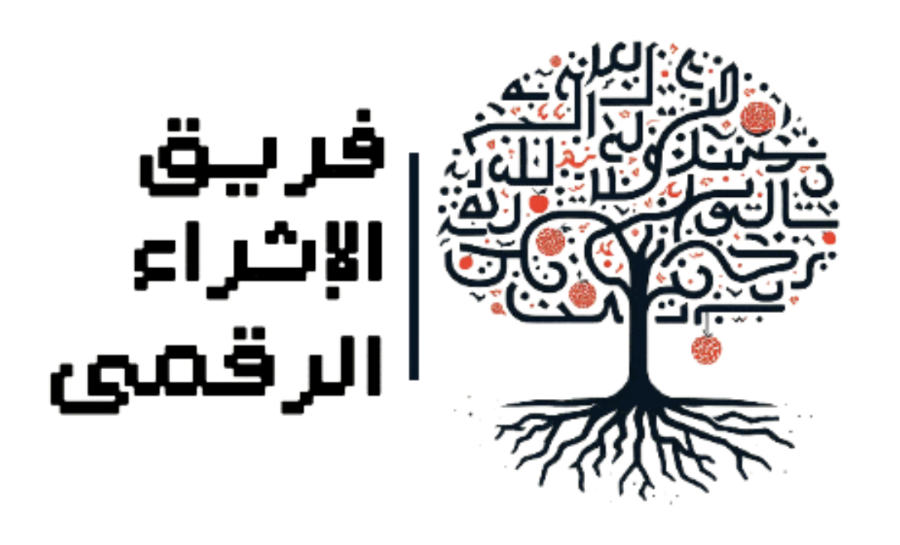

# Arabicthon 2023
- https://arabicthon.ksaa.gov.sa

## Team
- فريق الإثراء الرقمي

<p align="center">
    
</p>

## About
بناء منصة مؤتمتة ومدعومة بتقنيات معالجة اللغات الطبيعية التقليدية NLP ونماذج اللغة الضخمة LLM، لتسهيل عملية الإثراء المعجمي على الباحثين، ورفع جودة المدخلات، وتقليل الجهد المبذول، وزيادة سرعة المعجم على ملاحقة آخر التطورات اللغوية، عبر ربط المنصة بالمدونات الأجنبية.


## Developer Docs
### Setup Dev Environment (Mac)
```
brew install --cask miniforge
brew install pipx
conda create -n arabicthon python=3.10

conda activate arabicthon
pip install "poetry<1.2"

poetry lock
poetry install
```

### Run locally
```
streamlit run --server.enableCORS false --browser.gatherUsageStats false app/app.py
```

## License

This project is licensed under the MIT License